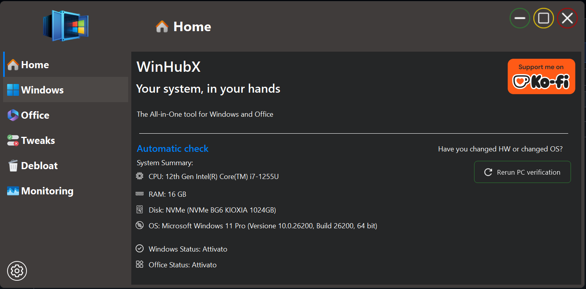
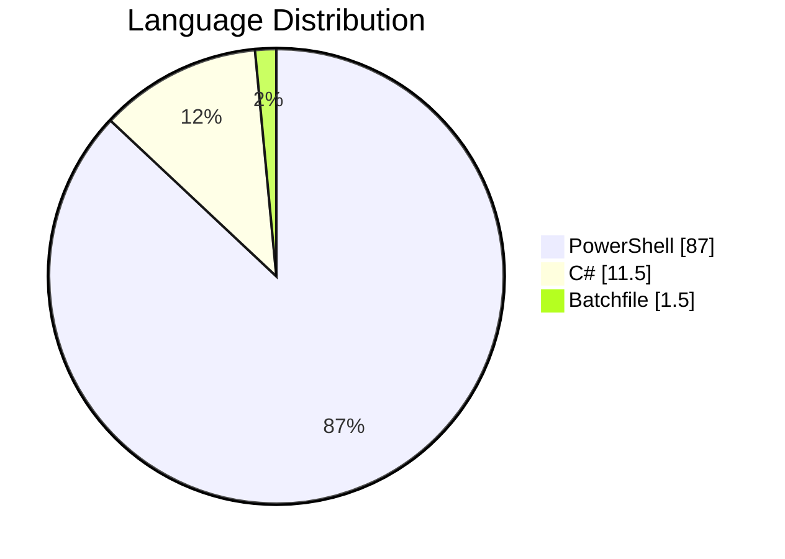

# WinHubX - The Ultimate Windows Optimization Toolbox 🚀  

  
  <h1>WinHubX</h1>
  
<strong>Your all-in-one solution for Windows optimization, customization, and management</strong>

  
  

    
    
    
  

## 🌍 Multi-Language Support
- 🇬🇧 **English**
- 🇮🇹 **Italiano**

---

## ✨ Key Features
✔ **Windows & Office ISO Downloader** - Get official Microsoft ISOs directly  
✔ **System Optimizer** - Boost performance with one click  
✔ **Privacy Manager** - Take control of your data  
✔ **Customization Toolkit** - Personalize your Windows experience  
✔ **Maintenance Center** - Keep your system running smoothly  
✔ **Network Utilities** - Advanced networking tools  
✔ **Security Tweaks** - Harden your system against threats  

---

## 📊 Technical Overview

## 📜 License
WinHubX is proudly open-source under the GNU GPL v3.0 License - free to use, modify, and share!

---

## 🔒 Security Verified
https://img.shields.io/badge/VirusTotal-Clean-green?style=flat&logo=virustotal

---

## 📰 Featured In
Publication	Link
YourLifeUpdate	Read Article
UIBlog	Read Article
GuruHitech	Read Article

---

## 🚀 Getting Started
👉 [Download the latest release](https://github.com/MrNico98/WinHubX/releases/latest)

---

## 💡 Why Choose WinHubX?

- 🎁 **Completely Free** — No ads, no paywalls  
- 🔄 **Regular Updates** — Continuously improved by the community  
- 🧰 **Comprehensive Toolkit** — Everything you need in one place  
- 🖥️ **User-Friendly** — Intuitive interface for all skill levels  

---

 <h3>Join our growing community of Windows enthusiasts!</h3>   

Created with ❤️ by MrNico98 and contributors
The original Windows optimization wizard
